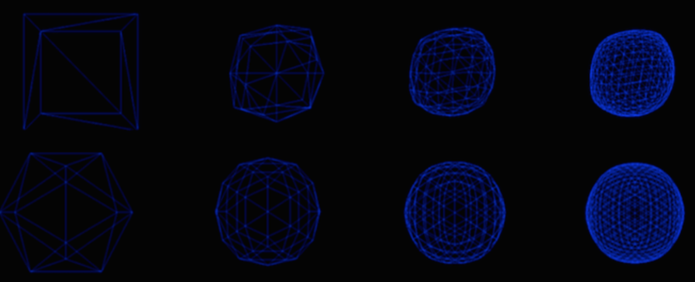

# Subdivision
Subdivision algorithms generate smooth well defined surfaces from course input meshes through an iterative refinement process that smooths the mesh while increasing its polygon count. The shape of the output mesh depends on the subdivision algorithm used. The Catmull-Clark subdivision scheme is used widely to smooth quad meshes while the loop subdivision algorithm is generally used for triangle meshes. This implementation supports loop subdivision.

Note: Requires Eigen 3.2.4 and assumes it is in /usr/local/Cellar/eigen/3.2.4/include/eigen3/
